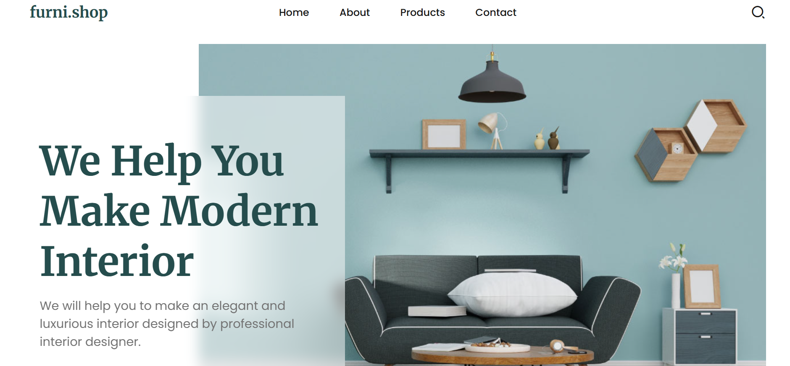

# 🛋️ Furniture Shop - Static Front-End Website

**Furniture Shop** is a beautifully designed static front-end website that showcases a range of modern, classic, and luxury furniture pieces. Built using **HTML**, **CSS**, and **JavaScript**, this project provides a clean, user-friendly interface to display products, promotions, and contact information in an elegant and engaging way.

---

## 🛠️ Features

- 🪑 Sleek and modern furniture catalog
- 💳 Product details page with pricing, descriptions, and reviews
- 🏠 Gallery showcasing various living room, bedroom, and office furniture
- 🛒 Simple shopping cart mockup for user interaction
- ✨ Smooth hover effects and transitions
- 📱 Fully responsive design optimized for both desktop and mobile devices

---

## ⚙️ Built With

- **HTML5**
- **CSS3** (Flexbox, Grid, animations)
- **Vanilla JavaScript** (interactive elements)

---

## ✨ Preview



---

## 🚀 How to Use

1. Clone the repository:
   ```bash
   git clone https://github.com/liyat-1/furniture-shop.git
   ```
